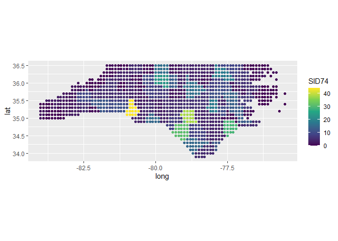

# RUtilpol

<!-- badges: start -->

[](https://CRAN.R-project.org/package=RUtilpol)
[](https://github.com/HOPE-UIB-BIO/R-Utilpol-package/actions)
<!-- badges: end -->

R-Utilpol is an R package proving utility functions for package
development.

## WARNING

:bangbang: This package is under active development. Therefore, the package is subject to change. :bangbang:

## Installation

You can install the development version of RUtilpol from
[GitHub](https://github.com/) with:

``` r
# install.packages("remotes")
remotes::install_github("HOPE-UIB-BIO/R-Utilpol-package")
```

## Usage

The main purpose of {RUtilpol} is to provide utility (helper) functions.
All functions can be grouped into 3 main categories:

1. **Package development** - Function used within other packages (e.g., `RUtilpol::check_class()` for safety check, `RUtilpol::output_warning()` - for console message, `RUtilpol::replace_null_with_na()` for data wrangling ,…).

2. [**File management**](#file-management) - Functions for saving and loading functions for better handling of files in large projects (see examples below).

3. [**Extraction of spatial information**](#extraction-of-spatial-information) - Functions to assign information to points based on a raster of shapefile (see examples below).

### File management

The file management system is created in order to load the most latest version of a file. In addition, while saving the file, it will overwrite ONLY if the file changes since the latest version.

``` r
# load {RUtilpol}
library(RUtilpol, verbose = FALSE)
# load {tidyverse}
library(tidyverse, verbose = FALSE)
# load {here} for better file navigation
library(here, verbose = FALSE)

# use the build-in dataset of `mtcars`
mtcars_to_use <- mtcars

RUtilpol::save_latest_file(
  object_to_save = mtcars_to_use,
  dir = here::here()
)
#> ✔ Have not find previous version of the file. Saving the file with rds format.

list.files(
  here::here()
) %>%
  stringr::str_subset(pattern = "mtcars_to_use")
#> [1] "mtcars_to_use_2023-03-16__d0487363db4e6cc64fdb740cb6617fc0__.rds"
```

Now we can load the file back and compare that it is truly the same dataset

``` r
# load waldo to compare files
library(waldo, verbose = FALSE)

# load the data back to R
mtcars_loaded <-
  RUtilpol::get_latest_file(
    file_name = "mtcars_to_use",
    dir = here::here()
  )
#> ✔ Automatically loaded file mtcars_to_use_2023-03-16__d0487363db4e6cc64fdb740cb6617fc0__.rds

# compare files
waldo::compare(
  x = mtcars_to_use,
  y = mtcars_loaded
)
#> ✔ No differences
```

Let’s alter the data and try to save it again.

``` r
# edit the `mtcars` datasets
mtcars_to_use$mpg <- mtcars_to_use$mpg - mean(mtcars_to_use$mpg)  

# save
RUtilpol::save_latest_file(
  object_to_save = mtcars_to_use,
  dir = here::here()
)
#> ✔ Found older file, overwriting it with new changes.
```

The function will overwrite the file unless there is a change of date, in which case, it will create a new file

``` r
# edit the `mtcars` datasets
mtcars_to_use$disp <- mtcars_to_use$disp - mean(mtcars_to_use$disp)  

# save
RUtilpol::save_latest_file(
  object_to_save = mtcars_to_use,
  dir = here::here(),
  current_date = "3000-01-01"
)
#> ✔ Found older file, overwriting it with new changes.

# check the files
list.files(
  here::here()
) %>%
  stringr::str_subset(pattern = "mtcars_to_use")
#> [1] "mtcars_to_use_2023-03-16__f2c54b73b4ed92edb5f94bb241d8e4ec__.rds"
#> [2] "mtcars_to_use_3000-01-01__43110f6a7f53a7572ed11d06db9f854f__.rds"

# load the data back to R. It will load the one with the most recent date
mtcars_loaded <-
  RUtilpol::get_latest_file(
    file_name = "mtcars_to_use",
    dir = here::here()
  )
#> ✔ Automatically loaded file mtcars_to_use_3000-01-01__43110f6a7f53a7572ed11d06db9f854f__.rds
```

A user can also specify several arguments as the name of the file (it is the same as the object name by default), the format of the file (`rds` as default), etc. Check the function documentation by calling `?RUtilpol::save_latest_file()`

``` r
# save the file with the `qs` format (fast and well-compressed)
RUtilpol::save_latest_file(
 object_to_save = mtcars_to_use,
 file_name = "mtcars_qs",
 prefered_format = "qs"
)
#> ✔ Have not find previous version of the file. Saving the file with qs format.

list.files(
  here::here()
) %>%
  stringr::str_subset(pattern = "mtcars_qs")
#> [1] "mtcars_qs_2023-03-16__43110f6a7f53a7572ed11d06db9f854f__.qs"
```

### Extraction of spatial information

The is only one main funcion `RUtilpol::geo_assign_value()`, which is created to help asinging values from shapefiles and TIF files to tbular data with points (lat & long coordinates).

#### Shapefiles

In order to demonstrate the usage with shapefile, we used the build-in North Carolina SIDS dataset from {sf} package.

``` r
# load the {sf} package for shapefile manipulation
library(sf)

# get {sf} example data
sf_example_data <-
  sf::st_read(system.file("shape/nc.shp", package = "sf"))

summary(sf_example_data)
#>       AREA          PERIMETER         CNTY_         CNTY_ID    
#>  Min.   :0.0420   Min.   :0.999   Min.   :1825   Min.   :1825  
#>  1st Qu.:0.0910   1st Qu.:1.324   1st Qu.:1902   1st Qu.:1902  
#>  Median :0.1205   Median :1.609   Median :1982   Median :1982  
#>  Mean   :0.1263   Mean   :1.673   Mean   :1986   Mean   :1986  
#>  3rd Qu.:0.1542   3rd Qu.:1.859   3rd Qu.:2067   3rd Qu.:2067  
#>  Max.   :0.2410   Max.   :3.640   Max.   :2241   Max.   :2241  
#>      NAME               FIPS               FIPSNO         CRESS_ID     
#>  Length:100         Length:100         Min.   :37001   Min.   :  1.00  
#>  Class :character   Class :character   1st Qu.:37051   1st Qu.: 25.75  
#>  Mode  :character   Mode  :character   Median :37100   Median : 50.50  
#>                                        Mean   :37100   Mean   : 50.50  
#>                                        3rd Qu.:37150   3rd Qu.: 75.25  
#>                                        Max.   :37199   Max.   :100.00  
#>      BIR74           SID74          NWBIR74           BIR79      
#>  Min.   :  248   Min.   : 0.00   Min.   :   1.0   Min.   :  319  
#>  1st Qu.: 1077   1st Qu.: 2.00   1st Qu.: 190.0   1st Qu.: 1336  
#>  Median : 2180   Median : 4.00   Median : 697.5   Median : 2636  
#>  Mean   : 3300   Mean   : 6.67   Mean   :1050.8   Mean   : 4224  
#>  3rd Qu.: 3936   3rd Qu.: 8.25   3rd Qu.:1168.5   3rd Qu.: 4889  
#>  Max.   :21588   Max.   :44.00   Max.   :8027.0   Max.   :30757  
#>      SID79          NWBIR79                 geometry  
#>  Min.   : 0.00   Min.   :    3.0   MULTIPOLYGON :100  
#>  1st Qu.: 2.00   1st Qu.:  250.5   epsg:4267    :  0  
#>  Median : 5.00   Median :  874.5   +proj=long...:  0  
#>  Mean   : 8.36   Mean   : 1352.8                      
#>  3rd Qu.:10.25   3rd Qu.: 1406.8                      
#>  Max.   :57.00   Max.   :11631.0

names(sf_example_data)
#>  [1] "AREA"      "PERIMETER" "CNTY_"     "CNTY_ID"   "NAME"      "FIPS"     
#>  [7] "FIPSNO"    "CRESS_ID"  "BIR74"     "SID74"     "NWBIR74"   "BIR79"    
#> [13] "SID79"     "NWBIR79"   "geometry"

plot(sf_example_data, max.plot = 14)
```


Let’s imagine we want to extract the value of `SID74` for a grid of 0.1 degree.

``` r
# make a table for the extend of the shapefile example shapefile
data_dummy_shapefile <-
  expand.grid(
    long = seq(-84, -75, 0.1),
    lat = seq(33, 37, 0.1)
  ) %>%
  as.data.frame() %>%
  tibble::as_tibble()

dplyr::glimpse(data_dummy_shapefile)
#> Rows: 3,731
#> Columns: 2
#> $ long <dbl> -84.0, -83.9, -83.8, -83.7, -83.6, -83.5, -83.4, -83.3, -83.2, -8…
#> $ lat  <dbl> 33, 33, 33, 33, 33, 33, 33, 33, 33, 33, 33, 33, 33, 33, 33, 33, 3…

# assing values of `SID74` to points from `data_dummy_shapefile`
data_with_values_shapefile <-
  RUtilpol::geo_assign_value(
    data_source = data_dummy_shapefile, # the data.frame we want to assing values to
    sel_method = "shapefile", # the format of the file, we want to use
    dir = system.file("shape", package = "sf"), # the folder to look for the file
    file_name = "nc", # name of the file to use
    var = "SID74" # the name of the variabe in the shapefile to use 
  ) %>%
  tidyr::drop_na(SID74) # drop all NA values
#> ✔ Selected shapefile resulted in the selected value: SID74
#> ✔ Data.frame contains the preferred values in variable: SID74

dplyr::glimpse(data_with_values_shapefile)
#> Rows: 1,258
#> Columns: 3
#> $ long  <dbl> -78.6, -78.5, -78.4, -78.3, -78.7, -78.6, -78.5, -78.4, -78.3, -…
#> $ lat   <dbl> 33.9, 33.9, 33.9, 33.9, 34.0, 34.0, 34.0, 34.0, 34.0, 34.0, 34.0…
#> $ SID74 <dbl> 5, 5, 5, 5, 15, 5, 5, 5, 5, 5, 5, 5, 15, 15, 15, 5, 5, 5, 5, 5, …

# plot results
ggplot2::ggplot(
  data = data_with_values_shapefile,
  mapping = ggplot2::aes(
    long, lat,
    col = SID74
  )
) +
  ggplot2::geom_point() +
  ggplot2::coord_quickmap() +
  ggplot2::scale_color_viridis_c()
```



#### TIF files

In order to demonstrate the usage with TIF file, we used the build-in elevational dataset from {terra} package.

``` r
# load {terra} package to obtain example of TIF file
library(terra)

# load build-in tif file
tiff_example <- 
  terra::rast(system.file("ex/elev.tif", package = "terra"))

summary(tiff_example)
#>    elevation    
#>  Min.   :141.0  
#>  1st Qu.:291.0  
#>  Median :333.0  
#>  Mean   :348.3  
#>  3rd Qu.:406.0  
#>  Max.   :547.0  
#>  NA's   :3942

plot(tiff_example)
```


Let’s imagine we want to extract the elevation for a grid of 0.01
degree.

``` r
# make a table for the extend of the shapefile example shapefile
data_dummy_tif <-
  expand.grid(
    long = seq(5, 6.5, 0.01),
    lat = seq(49, 51, 0.01)
  ) %>%
  as.data.frame() %>%
  tibble::as_tibble()

dplyr::glimpse(data_dummy_tif)
#> Rows: 30,351
#> Columns: 2
#> $ long <dbl> 5.00, 5.01, 5.02, 5.03, 5.04, 5.05, 5.06, 5.07, 5.08, 5.09, 5.10,…
#> $ lat  <dbl> 49, 49, 49, 49, 49, 49, 49, 49, 49, 49, 49, 49, 49, 49, 49, 49, 4…

# assing values of `SID74` to points from `data_dummy_tif`
data_with_values_tif <-
  RUtilpol::geo_assign_value(
    data_source = data_dummy_tif, # the data.frame we want to assing values to
    sel_method = "tif", # the format of the file, we want to use
    dir = system.file("ex", package = "terra"), # the folder to look for the file
    file_name = "elev", # name of the file to use
    tif_fill_na = FALSE # use only exact values
  ) %>%
  dplyr::rename(
    elevation = raster_values
  ) %>%
  tidyr::drop_na(elevation) # drop all NA values

dplyr::glimpse(data_with_values_tif)
#> Rows: 3,204
#> Columns: 3
#> $ long      <dbl> 5.98, 5.99, 6.03, 6.04, 5.98, 5.99, 6.02, 6.03, 6.04, 6.08, …
#> $ lat       <dbl> 49.45, 49.45, 49.45, 49.45, 49.46, 49.46, 49.46, 49.46, 49.4…
#> $ elevation <dbl> 428, 420, 315, 363, 397, 432, 338, 313, 330, 324, 347, 409, …

# plot results
ggplot2::ggplot(
  data = data_with_values_tif,
  mapping = ggplot2::aes(
    long, lat,
    col = elevation
  )
) +
  ggplot2::geom_point(size = 0.5) +
  ggplot2::coord_quickmap() +
  ggplot2::scale_color_viridis_c()
```


